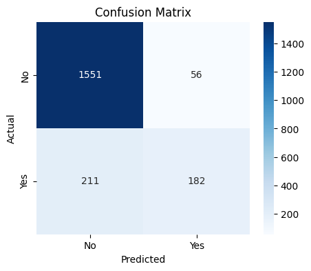
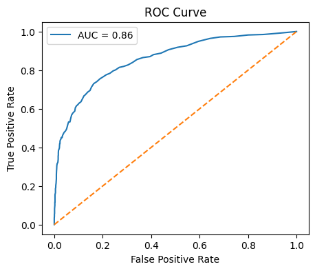
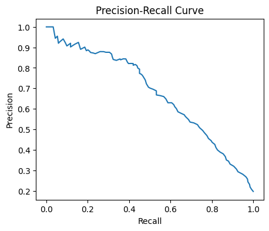

# **Churn Prediction Project**

##### **Project Overview**

This project focuses on predicting customer churn using machine learning techniques.  

The objective is to identify customers likely to leave a service and understand the factors contributing to churn.

##### **Dataset**

The dataset contains customer demographic and behavioral data.

\- Target variable: \*\*Churn (Yes / No)

##### **Tools \& Technologies**

1. Python
2. Pandas, NumPy
3. Matplotlib, Seaborn
4. Scikit-learn
5. Jupyter Notebook

##### **Data Preprocessing**

* Data cleaning
* Encoding categorical variables
* Feature scaling (numeric features only)
* Train-test split

##### **Model**

* Logistic Regression

##### **Evaluation Metrics**

**Accuracy - 86.65%**

Precision - 76%

Recall - 46%

Confusion Matrix  \[1551   56]

&nbsp;                 \[211   182]

## 📊 Model Evaluation

### Confusion Matrix

### ROC Curve

### Precision–Recall Curve

##### **Key Insights**

\- Class imbalance affects model performance

\- Recall–Precision trade-off is important for churn prediction

\- Threshold tuning can improve business usefulness

##### **Future Improvements**

\- Hyperparameter tuning

\- Advanced models (Random Forest, XGBoost)

\- Better feature engineering

---

##### **Author**

**Emmanuel**  

[GitHub](https://github.com/E-Novoxtech)

